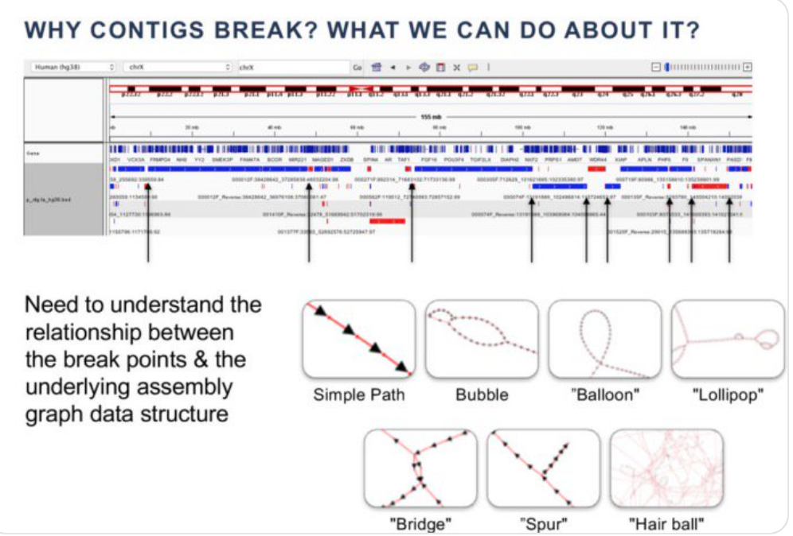

In the [previous lesson](08_bin_completion_with_spacegraphcats.md), we observed that querying our metagenome with a *de novo* assembled genome returned a neighborhood XX% larger than the query.
Now we will assemble our query neighborhood and determine whether it contains additional amino acid sequences that were not in our query.

## But wasn't assembly a problem?

Yes! As we discussed last lesson, *de novo* assembly and binning are often part of the problem -- 
assemblers decide not to make a decision when they're faced with too many options.
Look at the graphic below. 
It depicts some common structures in cDBGs that can lead to contigs breaking.

A lot of variation that occurs in sequences occurs at the *nucleotide* level. 
This is in part attributable to [third base pair wobble](https://www.tandfonline.com/doi/full/10.1080/15476286.2017.1356562),
which leads to [silent variation in nucleotide sequences ](https://www.nature.com/articles/s41592-019-0437-4) that confounds nucleotide assembly.
One way to circumvent assembly problems that arise from sequence variation is to assemble in amino acid space.
Amino acid assemblers translate nucleotide reads into amino acid space, and then find overlaps between the translated amino acid sequences to assemble open reading frames.
In the context of metagenomes, this results in many more assembled open reading frames that can then be analyzed for their functional potential.

We will use the [PLASS](https://www.nature.com/articles/s41592-019-0437-4) amino acid assembler to assemble our query neighborhood. 
Then, we will compare the proteins we assembled with PLASS to those in the original query. 

